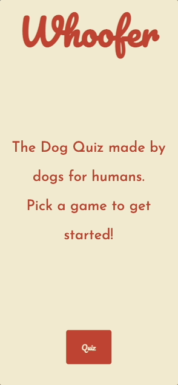

# Whoofer

A stylized Dog Breed Quiz App, written in React & NextJS.
Built for a deeper understanding of React, NextJS and CSS Modules.
For having fun, and for the love of dogs!

## Getting Started

This site is hosted on [Whoofer](https://whoofer.vercel.app) and the live version can be visited there.

For a local version, once you have cloned the repo, run `npm i` to install all dependencies. And then `npm run dev` to fire up a local NextJS server instance.

## Built With

* [React](https://react.dev/)
* [NextJS](https://nextjs.org/) - A React Framework
* [Vercel](https://vercel.com/) - Used for deployment and analytics

## Acknowledgments

* [Ameera Ali](https://www.linkedin.com/in/ameera-ali-m/) - UI/UX Design 
* [Matt Banh](https://www.linkedin.com/in/mattbanh/) - Code Reviews
